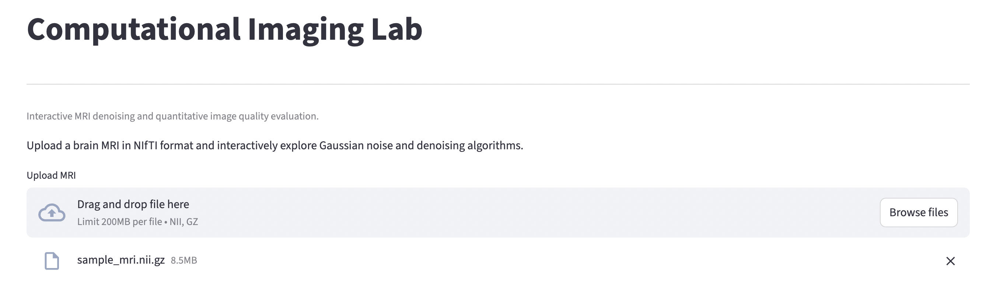
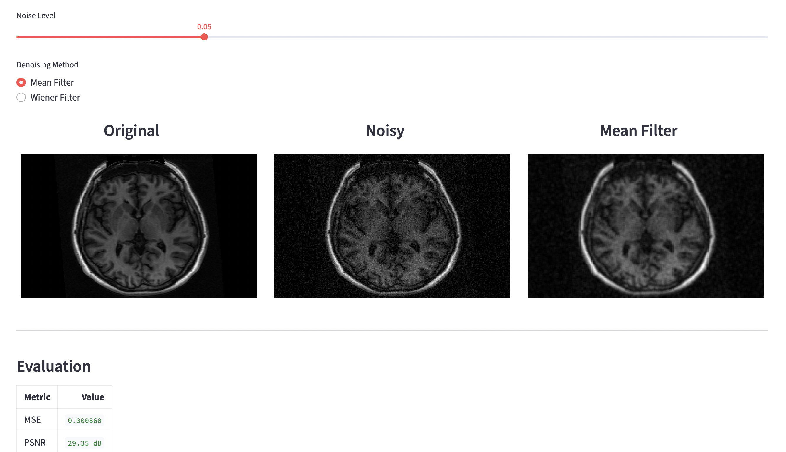
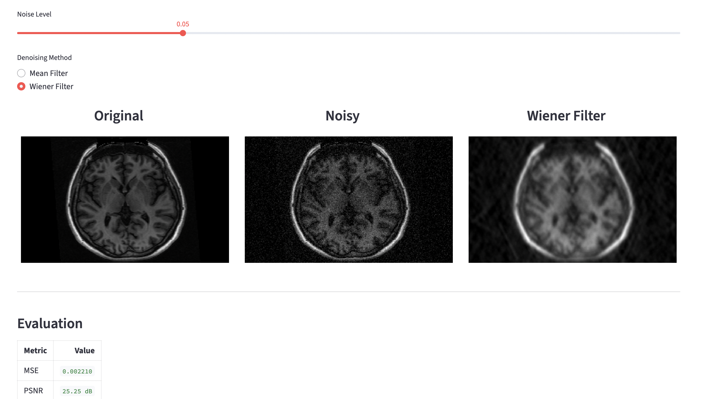

# 🧠 Computational Imaging Lab

An interactive Streamlit application for MRI denoising and quantitative image quality evaluation.

This project demonstrates a complete medical image processing pipeline, including MRI loading, noise simulation, denoising algorithms, and objective quality assessment.

---

## Features

- Load brain MRI scans in `.nii` and `.nii.gz` (NIfTI) format
- Visualize the middle MRI slice
- Add adjustable Gaussian noise
- Compare multiple denoising algorithms:
  - Mean Filter
  - Wiener Filter
- Quantitatively evaluate reconstruction quality using:
  - Mean Squared Error (MSE)
  - Peak Signal-to-Noise Ratio (PSNR)
- Interactive user interface built with Streamlit

---

## Application



---

## Technologies

- Python
- Streamlit
- NumPy
- Matplotlib
- NiBabel

---

## Project Structure

```text
computational-imaging-lab/
│
├── app/
│   └── main.py
│
├── src/
│   ├── degradation/
│   ├── metrics/
│   ├── mri/
│   ├── reconstruction/
│   └── visualization/
│
├── tests/
│
├── requirements.txt
└── README.md
```

---

## Installation

Clone the repository:

```bash
git clone https://github.com/yourusername/computational-imaging-lab.git
cd computational-imaging-lab
```

Create a virtual environment:

```bash
python -m venv .venv
```

Activate it:

### macOS/Linux

```bash
source .venv/bin/activate
```

### Windows

```bash
.venv\Scripts\activate
```

Install dependencies:

```bash
pip install -r requirements.txt
```

---

## Running the Application

```bash
streamlit run app/main.py
```

Then open:

```
http://localhost:8501
```

---

## Algorithms Implemented

### Gaussian Noise

Simulates acquisition noise by adding Gaussian-distributed random values to the MRI image.

### Mean Filter

Reduces noise by replacing each pixel with the average of its neighboring pixels.


### Wiener Filter

Performs adaptive denoising based on local image statistics to better preserve anatomical structures.


### Evaluation Metrics

- Mean Squared Error (MSE)
- Peak Signal-to-Noise Ratio (PSNR)

---

## Future Improvements

- Additional denoising algorithms
- Slice selection
- MRI volume visualization
- Docker support
- Continuous Integration (GitHub Actions)

---

## Author

**Nilüfer Sevde Özdemir**